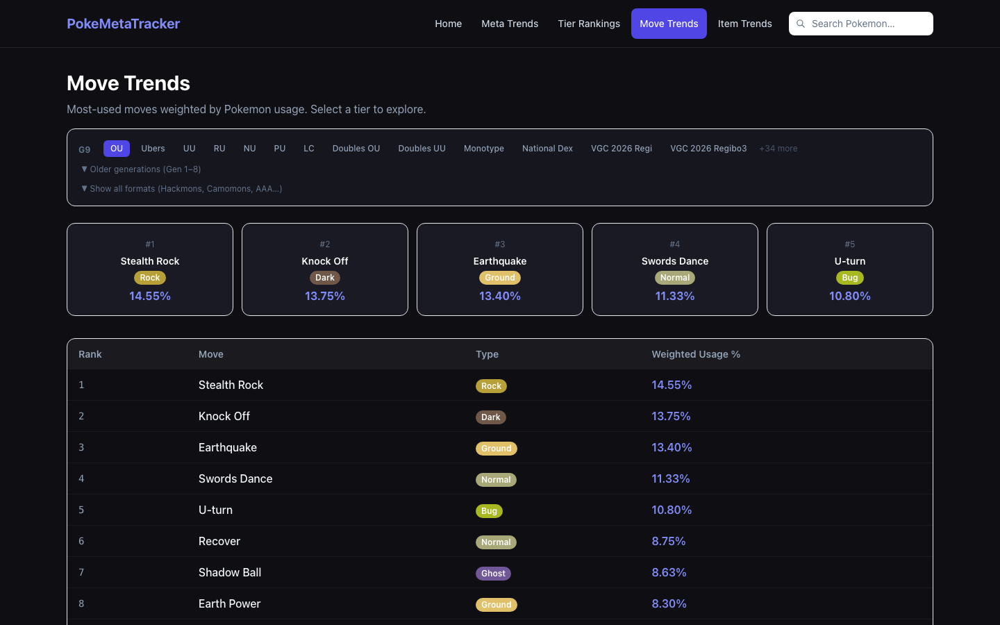

# PokeMetaTracker

Track the Pokemon Showdown competitive meta with real Smogon usage data.

[Live site](https://pokemetatracker-psi.vercel.app)

## What it does

PokeMetaTracker pulls monthly usage statistics from Smogon and presents them in a way that's actually useful: you can browse any competitive tier from Gen 1 through Gen 9, see which Pokemon are rising or falling, and dig into individual movesets, items, teammates, and counters. The data covers over 1,000 Pokemon across 100+ formats and updates automatically each month when Smogon publishes new stats.

## Tech stack

- Next.js 14 (App Router)
- TypeScript
- Tailwind CSS
- Recharts
- PokeAPI
- Smogon Usage Statistics
- Vercel

## Running locally

1. Clone the repo and install dependencies with `npm install`
2. Run `npm run dev`
3. Open [http://localhost:3000](http://localhost:3000)

No environment variables needed. The app fetches public Smogon and PokeAPI data at runtime.

## Data sources

Usage statistics come from [Smogon's monthly stat dumps](https://smogon.com/stats/), which the app parses directly. Pokemon metadata (types, base stats, artwork) comes from [PokeAPI](https://pokeapi.co/). Both are public and require no API keys.

## Auto-updates

There's no cron job or manual step to keep the data fresh. On each request, the server checks Smogon's directory for the latest available month and caches it for 24 hours. When Smogon publishes new stats at the end of each month, the site picks them up automatically on the next cache refresh.
